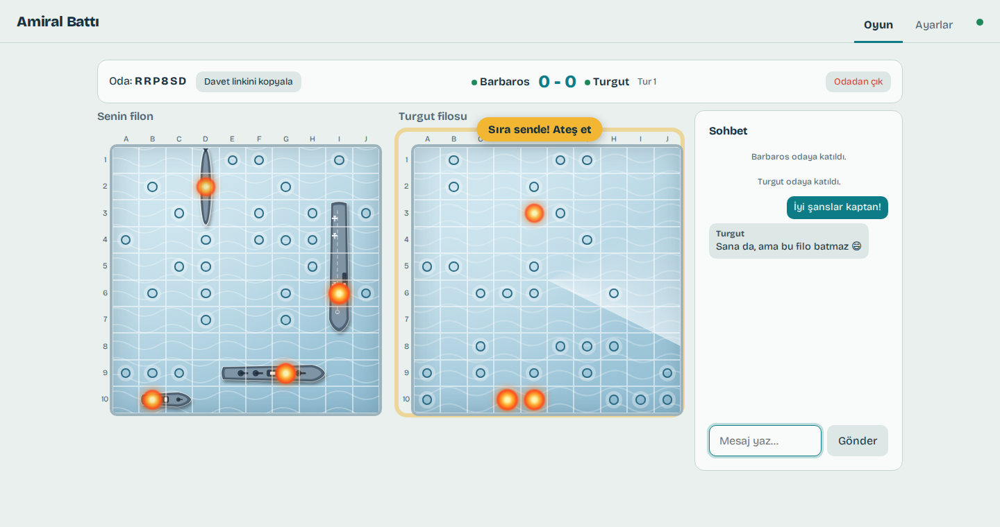
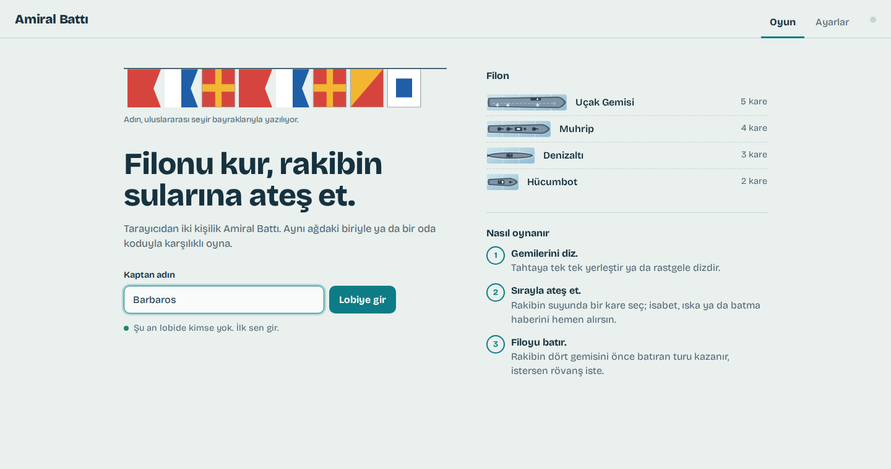
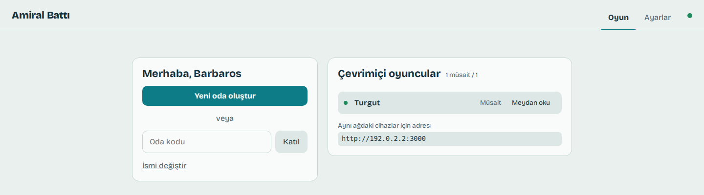
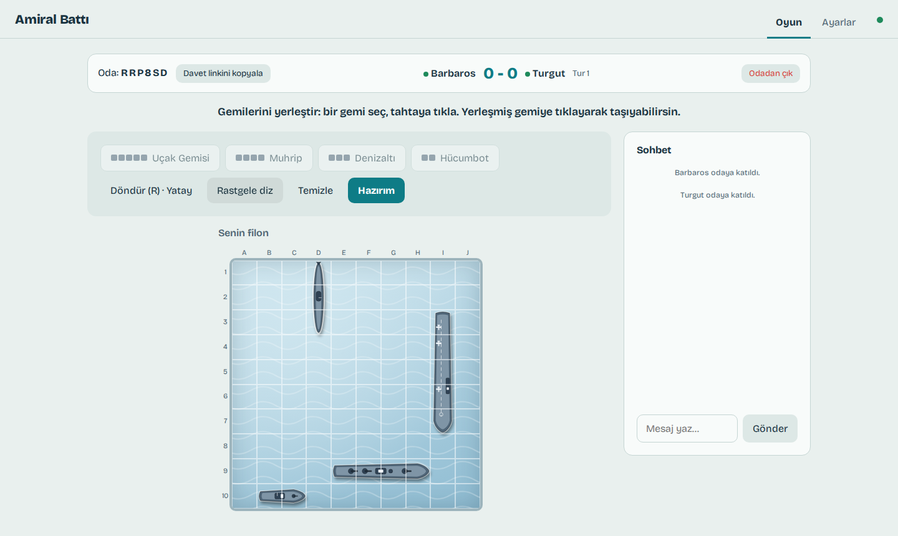
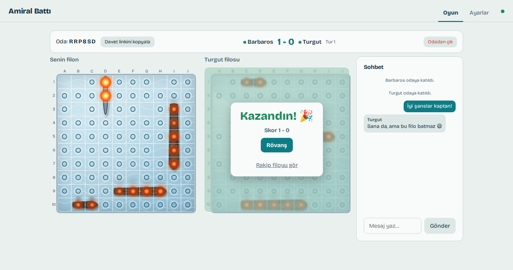
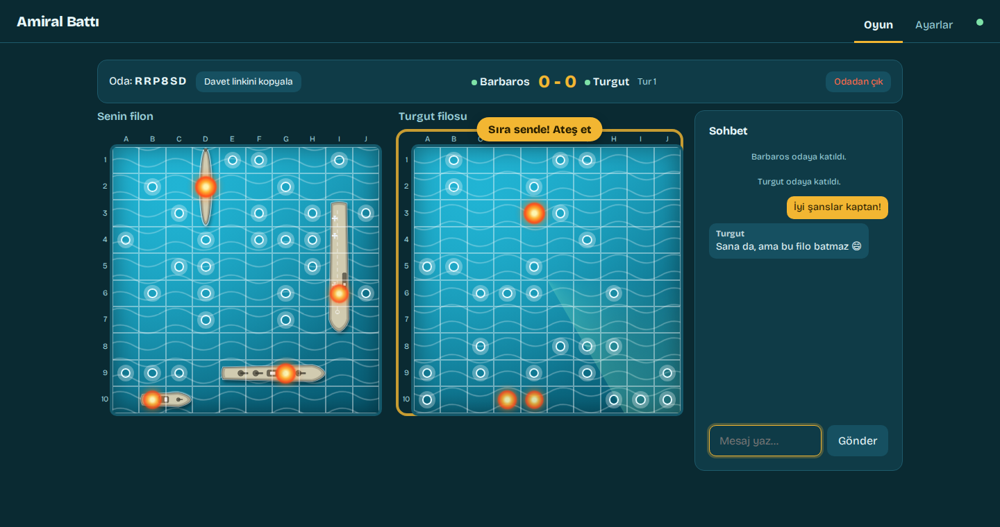
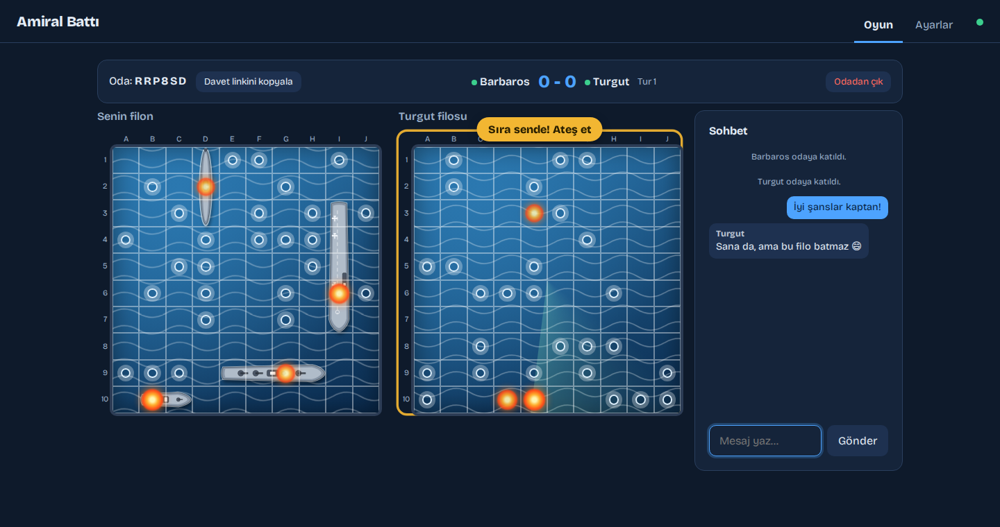
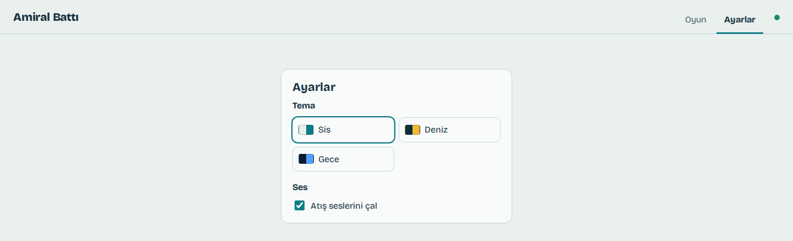
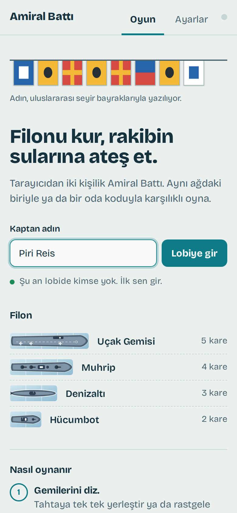

# ⚓ Amiral Battı

WebSocket ile gerçek zamanlı, tarayıcıda iki kişilik Amiral Battı.

**Canlı demo:** https://amiral-batti-h2mx.onrender.com (kurulum gerekmez; ücretsiz planda bir süre kullanılmayınca uyur, ilk açılış yarım dakika sürebilir)



## Özellikler

- 10x10 tahta, 4 gemi: Uçak Gemisi (5), Muhrip (4), Denizaltı (3), Hücumbot (2)
- Gemileri elle yerleştirme (tıkla, R ile döndür, yerleşmiş gemiye tıklayıp taşı) veya **rastgele diz**
- Oda kodu ve davet linki (`?oda=KOD`) ile arkadaşınla oyna
- **LAN lobisi:** Aynı ağdaki oyuncular lobide "Çevrimiçi oyuncular" listesinde görünür (müsait / maçta), birbirine **meydan okuyup** eşleşir. Davetler 30 saniye geçerlidir; iptal edilebilir veya reddedilebilir
- Tahta üstü durum yazıları: "Sıra sende! Ateş et", "Rakip nişan alıyor…", maç sonunda tahtanın üstünde sonuç kartı
- Oyun içi sohbet
- İki oyuncu arasında skor tablosu (rövanşlarda korunur)
- Maç sonu **rövanş**: iki oyuncu da isterse yeni tur başlar, ilk atış sırası değişir
- **Ayarlar** sekmesi: 3 tema (açık renkli Sis varsayılan, Deniz, Gece) ve ses açma/kapama
- Sayfa yenilense de oyuna geri dönme; 60 saniye dönmeyen oyuncu hükmen kaybeder
- Sunucu otoriter: rakibin gemileri oyun bitene kadar tarayıcıya hiç gönderilmez

## Ekran görüntüleri

| Giriş | Lobi |
| --- | --- |
|  |  |

| Gemi dizme | Maç sonu |
| --- | --- |
|  |  |

| Deniz teması | Gece teması |
| --- | --- |
|  |  |

| Ayarlar | Telefonda giriş |
| --- | --- |
|  |  |

## Çalıştırma

```bash
npm install
npm run dev        # sunucu :3000, istemci http://localhost:5173
```

İki farklı sekmede açıp kendinle oynayabilirsin (her sekme ayrı oyuncudur).

### Aynı ağdan (LAN) oynama

Sunucu tüm ağ arayüzlerini dinler. Başlarken konsola `Aynı ağdaki cihazlar için: http://192.168.x.x:3000` gibi adresler yazılır, lobide de aynı adres görünür. Aynı Wi-Fi/ağdaki arkadaşların bu adresi tarayıcıda açıp isim girince listede görünür. `npm run dev` ile açtıysan adres `:5173` portuyla gelir. Güvenlik duvarı bağlantıyı engelliyorsa 3000 (ve dev için 5173) portuna izin ver.

Üretim:

```bash
npm run build
npm start          # http://localhost:3000 hem sayfayı hem WebSocket'i sunar
```

### Telefondan deneme

- **Aynı Wi-Fi:** Bilgisayarında `npm run build && npm start` çalıştır, konsolda yazan `http://192.168.x.x:3000` adresini telefonda aç.
- **İnternetten:** Repoyu [Render](https://render.com)'a bağla (New, Blueprint). `render.yaml` hazır; ücretsiz planda WebSocket çalışır, oda durumu sunucu belleğinde tutulur.

## Komutlar

| Komut | Açıklama |
| --- | --- |
| `npm run dev` | Geliştirme sunucusu (sıcak yenileme) |
| `npm run build` | İstemciyi `dist/client` içine derler |
| `npm start` | Derlenmiş oyunu `PORT` (varsayılan 3000) üzerinde sunar |
| `npm test` | Oyun kuralları ve oda testleri (Vitest) |
| `npm run typecheck` | TypeScript tip kontrolü |

## Yapı

```
shared/   Kurallar (gemiler, yerleştirme, atış) ve WebSocket protokolü (Zod)
server/   HTTP + WebSocket sunucusu, oda/oyun durumu
client/   Vite ile derlenen arayüz (TypeScript, framework yok)
tests/    Birim testleri
docs/     README ekran görüntüleri
```
